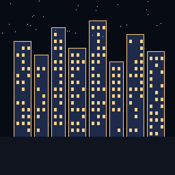

# 🏙 VaultCity

**Your Obsidian vault as a living 3D city.**

Folders become districts. Notes become buildings. Links become roads. Watch your knowledge base come alive with bloom-lit windows, dynamic shadows, and a day/night cycle.



## Features

- **3D City Visualization** — Each note is a building whose height reflects its link degree. Folders form colored districts.
- **Auto-Discover Vaults** — Scans your drives for `.obsidian` folders and loads them automatically.
- **Bloom Post-Processing** — Windows glow with emissive textures at night.
- **Day/Night Cycle** — Slider controls sun position, fog, ambient light, and bloom intensity.
- **Shadows** — PCF soft shadow mapping from a moving sun.
- **Neon Wireframes** — Color-coded edges per district for visual clarity.
- **District Toggle** — Show/hide neighborhoods with a click.
- **Search** — `⌘K` / `Ctrl+K` to search notes; camera flies to matching buildings.
- **Note Inspector** — Click a building to read its markdown content rendered inline.
- **Live Sync** — File watcher auto-rebuilds the city when you edit notes in Obsidian.
- **Streetlights & Trees** — Ambient props scattered between buildings.
- **Star Field** — Procedural sky with stars at night.

## Tech Stack

| Layer | Tech |
|-------|------|
| Desktop shell | [Tauri v2](https://v2.tauri.app/) (Rust) |
| 3D renderer | [Three.js r160](https://threejs.org/) |
| Post-processing | UnrealBloomPass + PCFSoftShadowMap |
| Markdown | [marked](https://marked.js.org/) |
| Build | [Vite](https://vitejs.dev/) |
| File watching | [notify](https://crates.io/crates/notify) (Rust) |

## Prerequisites

- [Node.js](https://nodejs.org/) ≥ 18
- [Rust](https://rustup.rs/) ≥ 1.77
- [Tauri CLI v2](https://v2.tauri.app/start/prerequisites/): `cargo install tauri-cli --version "^2"`
- An [Obsidian](https://obsidian.md/) vault somewhere on your machine

## Setup

```bash
# Clone
git clone https://github.com/YOUR_ORG/vaultcity.git
cd vaultcity

# Install JS dependencies
npm install

# Run in dev mode (Vite + Tauri hot reload)
cargo tauri dev
```

On first launch, VaultCity scans your drives for Obsidian vaults and auto-loads the first one it finds. You can also click **Open vault** to pick one manually.

## Build a Release

```bash
cargo tauri build
```

The installer lands in `src-tauri/target/release/bundle/`. The standalone `.exe` is at `src-tauri/target/release/vaultcity.exe` (~11 MB).

## Architecture

```
vaultcity/
├── index.html              # Entry point (Vite serves this)
├── vite.config.js          # Vite config with Tauri HMR
├── package.json            # JS deps: three, marked, @tauri-apps/api
├── src/
│   ├── city.js             # 3D renderer (buildings, bloom, shadows, day/night)
│   ├── app.js              # Orchestrator (discover, load, districts, search, inspector)
│   └── style.css           # Glass HUD, dark theme
└── src-tauri/
    ├── Cargo.toml          # Rust deps: tauri, notify, serde
    ├── tauri.conf.json     # Tauri window + security config
    ├── capabilities/
    │   └── default.json    # Dialog + file permissions
    └── src/
        ├── main.rs         # Commands: discover_vaults, load_vault, read_note, watch_vault
        └── vault.rs        # Graph builder: walks .md files, extracts wikilinks
```

## How It Works

1. **Discover** — Rust scans drive roots for `.obsidian` folders.
2. **Build Graph** — `vault.rs` walks all `.md` files, extracts `[[wikilinks]]`, frontmatter tags, and word counts. Returns `{ nodes, edges, districts }`.
3. **Render City** — `city.js` maps each node to a `BoxGeometry` building. Height = link degree. Folder = district color. Canvas-generated window textures with emissive glow.
4. **Connect** — Edges become thin lines between buildings (roads).
5. **Interact** — Raycaster handles click (inspector) and hover (highlight). Search filters building visibility. Day/night slider drives the sun, fog, and bloom.

## Controls

| Input | Action |
|-------|--------|
| Left drag | Orbit camera |
| Right drag | Pan |
| Scroll | Zoom |
| Click building | Open inspector |
| `⌘K` / `Ctrl+K` | Focus search |
| `Esc` | Close inspector / blur search |

## Privacy

VaultCity runs **100% locally**. No telemetry, no cloud, no external API calls. Your vault data never leaves your machine.

## License

[MIT](LICENSE)
